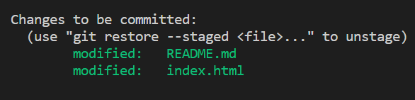

# Another-demo
1st not working. Testing
Let's see how to make it work. Files don't automatically get saved in windows file system. That creates a problem when using cd as there is no path to the wanted/desired path.( as there is no file)
# next change
The clone directory worked and the file was copied to the local file system.

But the git status command still not working properly. FOUND ITTT. we NEED TO SAVE THE FILE IN VSCODE TO GET (M) next to the file. Now we can get the proper status
# next change made in index html file
# git commit 
We need to specify the file with git add <file> before commiting
needs to be with -m "message" which is a message explaining the change/ description
# To commit all files together
We use 1st git add --all and then git commit -m 

# git push 
use ssh key. Generation pic in discord
# sshkey generation. in disc
Why? there is the private key which is the test key and the public key is the one which is fine to show online.
The ssh key is used to show github that it's you.( only you can generate the public key from your private key)